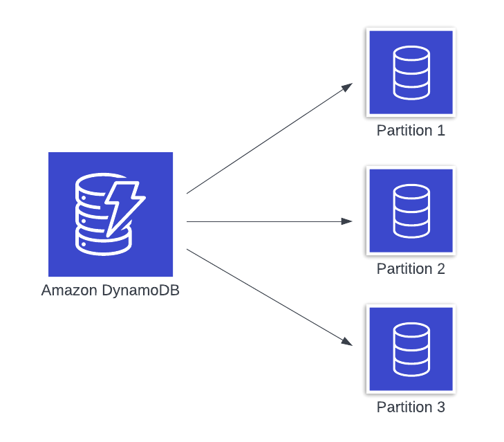

# DynamoDB

## Core mechanism

DynamoDB relies on two core mechanisms:&#x20;

* Partitioning and&#x20;
* the B-tree

With these solid foundations, DynamoDB is able to scale tables to petabytes of data and millions of concurrent queries.&#x20;

No matter the size of your database or the number of concurrent queries, DynamoDB aims to provide the same single-digit millisecond response time for all operations.

### Partitioning

In a traditional relational database, you store all items on a single node. As your data or usage grows, you might increase your instance size to keep up. However, vertical scaling has its limits, and often you find that the performance of relational databases degrade as data size increases.&#x20;

To avoid this, DynamoDB uses partitioning to provide horizontal scalability. Each item in your DynamoDB table will include a partition key. Under the hood, DynamoDB is sharding your database into segments called _partitions_ (as shown in Figure 1 that follows), each of which holds a maximum of 10 GB of data.

When a request comes to DynamoDB, the request router layer looks up the location of the partition for the given item and routes the request to the proper partition for processing.

<figure><figcaption></figcaption></figure>

### B-tree

While partitioning enables horizontal scaling, we often need to fetch a range of related items in a single request. That’s where DynamoDB’s second core mechanism comes in. A [B-tree](https://en.wikipedia.org/wiki/B-tree) is an efficient way to maintain sorted data. This is useful in many data applications, such as sorting usernames in alphabetical order or sorting e-commerce orders by the order timestamp.

DynamoDB stores the items on each partition in a B-tree that are ordered according to their partition key and (if used by the table) sort key. This B-tree provides logarithmic time complexity for finding a key. This use of a B-tree on subsets of your data allows for highly efficient range queries of items with the same partition key.

## Billing

DynamoDB’s billing is based on write capacity units (WCUs) and read capacity units (RCUs).&#x20;

* One WCU allows you to write 1 KB of data
* One RCU allows you to read 4 KB of data.

And both of these costs increase with the size of the data you’re reading or writing. You can provision read and write capacity units in advance, or you can use on-demand billing to pay for each read or write request as it comes in.&#x20;

## Single-Table vs. Multi-Table Design&#x20;

Single-Table Design:

* Single-table design applies to a single service
  * Think of a DynamoDB table similar to an RDBMS instance—everywhere you would have a separate RDBMS instance, you should have a separate DynamoDB table.
* Main Rule when combining entities/instances in one table: **Items that are accessed together should be stored together**
* Use single-table design when:
  * You need to provide joins - fetching two items in one request is possible by assigning two entities to one primary key
  * Less operational burden as you have just a few tables instead of many
  * Reduce costs on large items

Multi-Table Design:

* Good when:
  * Multiple needs for DynamoDB Streams as consumers are limitted. With Single-Table Design you need more consumers
  * Easier data export
  * Benefits of Single-Tables are not necessary
