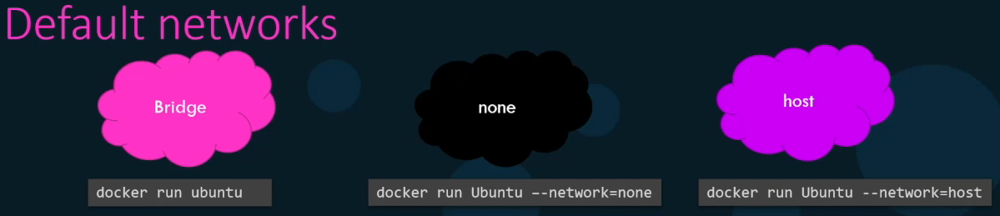

# Networking

* Networking is provided through pluggable "Network Drivers"
  * LibNetwork
* By default Docker offers 3 drivers
  *   bridge (default) - Used for communication between containers on a single host

      * Private internal network created by docker on the host
      * Containers get an internal IP-Address
      * Containers can communicate outward
      * To access container from outside, the ports of containers must be mapped to ports on the host
      *

      ```
      <div align="left">
      ```

      ```
      <figure><figcaption></figcaption></figure>

      </div>
      ```
  * host - Containers will be directly connected to all interfaces available on the host
    * No IP-Address
    * No port mapping
    * Containers are accessible over ports
    * Port number can only be used once
  * overlay - Network layer that spans multiple hosts and is only relevant for Swarm-Mode
  * none - Containers are not attached to any network
    * No connection to external network or other containers

<figure><figcaption></figcaption></figure>

### Embedded DNS

<figure><figcaption></figcaption></figure>

### Link

<figure><figcaption></figcaption></figure>

### Commands

<table data-header-hidden><thead><tr><th width="224"></th><th></th></tr></thead><tbody><tr><td>List available networks</td><td><strong><code>$ docker network ls</code></strong></td></tr><tr><td>Create network</td><td><strong><code>$ docker network create --driver bridge &#x3C;name></code></strong></td></tr><tr><td>Run container with selected network</td><td><strong><code>$ docker run --network=&#x3C;name></code></strong></td></tr><tr><td>Expose container port 8080 at 80 on host</td><td><strong><code>$ docker run -p 80:8080</code></strong></td></tr><tr><td>Expose container port 8080 to some port in the range 8000-9000</td><td><strong><code>$ docker run -p 8000-9000:8080</code></strong></td></tr><tr><td>Connect/Disconnect network interfaces at runtime</td><td><strong><code>$ docker network (dis)connect &#x3C;network-name> &#x3C;container-name></code></strong></td></tr><tr><td>Inspect network</td><td><strong><code>$ docker network inspect &#x3C;name></code></strong></td></tr></tbody></table>
