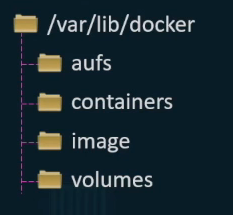
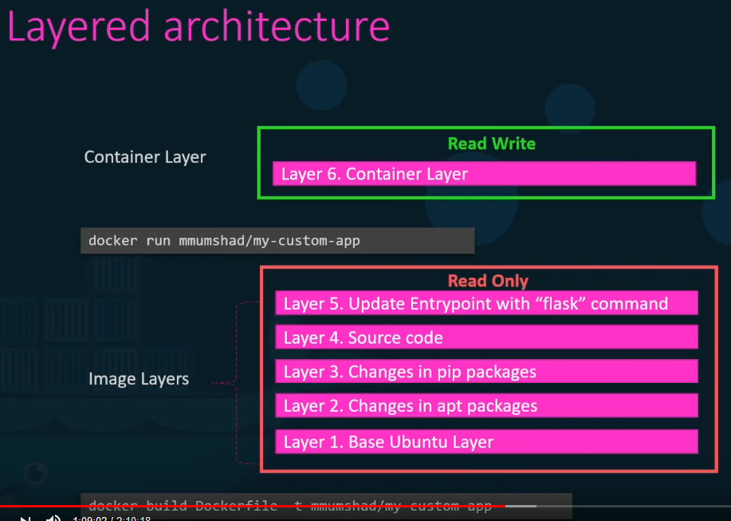

# Storage

### Docker Filesystem

All docker data is stored in this path

<div align="left"><figure><figcaption></figcaption></figure></div>

### Image Layers

* Each docker image references a list of read-only layers
* For each command line in a dockerfile, a new image layer is added to the stack

#### Following dockerfile would result in following storage layers:

```docker
FROM Ubuntu RUN apt-get update && apt-get -y install python RUN pip install flask 
COPY . /opt/source-code 
ENTRYPOINT FLASK_APP=/opt/source-code/app.py flask run
```

<div align="left"><figure><figcaption></figcaption></figure></div>

### Container Layer

When a container is created from an image, Docker creates a writable container layer (see above). All changes made to the running container are written to this writable container layer:

* Writing new files
* Modifying existing files
* Deleting files

\
All data written to the writable layer will be deleted when the corresponding container is deleted.
