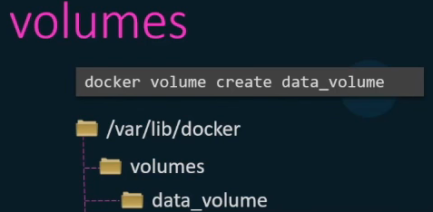
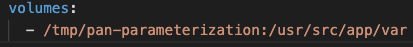

# Volumes

Data volumes are used to persist data that outlives the container.

* A data volume is a directory or file in the docker host filesystem that is mounted directly to a container
  * Therefore: Operates on host speed

<figure><figcaption></figcaption></figure>

* Volumes are mounted when a container is created
  * If the containers image contains data at the specified mount point, that existing data is copied into the new volume upon volume initialization

<figure><figcaption></figcaption></figure>

### Mounting

There are 2 types of mounting:

* Volume mounting
  * Mounts a volume from the directory `/var/lib/docker/volumes`
    * If no volume is created while mounting, docker will automatically create one
* Bind mounting
  * Mounts any directory from the host e.g `/user`
  * This example mounts the folder
    * `/tmp/pan-parameterization into the container -> /usr/src/app/var`

<figure><figcaption></figcaption></figure>

