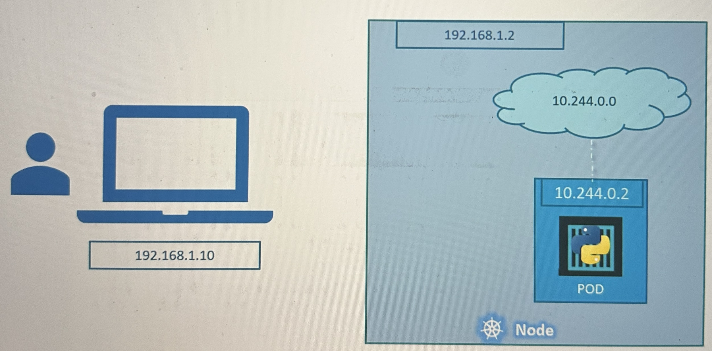
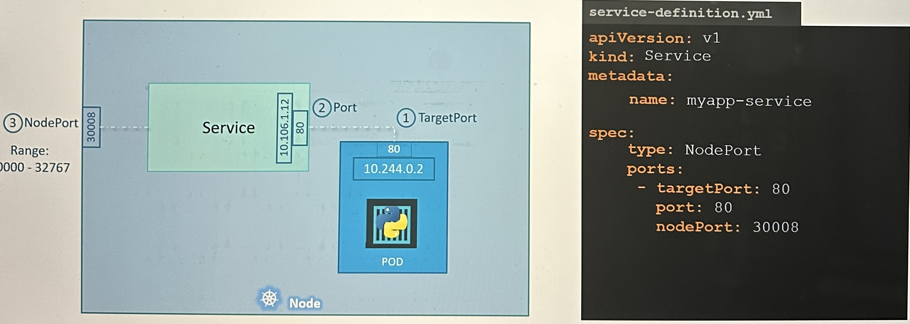

# Services

Services enable communication to the outside world and between Pods and group of Pods (like communication between frontend and backend replicas/pods). Services also allow loose coupling between microservices.

<div align="left">

<figure><figcaption></figcaption></figure>

</div>

## Service Types

1. NodePort
   * The service makes an internal port accessible (from outside) on a port on the node
2. ClusterIP
   *   The service creates a virtual IP inside the cluster to enable communication

       between different services, such as a set of front-end servers to a set of back-end servers
3. LoadBalancer
   * It provisions a load balancer for our application in supported cloud providers

<div align="left">

<figure><figcaption></figcaption></figure>

</div>

## Understanding Network Setup

* 192.168.1.10 -> Client IP Address, usually home network etc.
* 192.168.1.2 -> Kubernetes Cluster IP, either home network or public IP if e.g hosted in Cloud
* 10.244.0.0 -> Internal Pod network IP-Range
* 10.244.0.2 -> Pod IP-Address

With this setup, client couldn't ping the Pod inside the Kubernetes Cluster. And also Pods couldn't talk to the outside world. Serivces helps to map request to the node from the client through the node to the pod running the web container.

<div align="left">

<figure><figcaption></figcaption></figure>

</div>

## NodePort

In this example, traffic will be redirect from

`nodePort` \<node-url>:30008 -> `port` 80 -> `targetPort` 80

<figure><figcaption></figcaption></figure>

* `nodePorts` have a range between 30000 - 32767
  * if no `nodePort` is provided, it will automatically assign a free port within the range
* `port` is the Service Port
* `targetPort` is the Pods Port
  * If no `targetPort` is provided, it will take the `port` value

### NodePort YAML Config

The service can have multiple port mappings. Pods and Serivces are connected by label selectors:

* If a Service is created, it will find the Pods by labels and connect them to the Service. If it finds multiple Replicas of a Pod, the Service will automatically do the Load Balancing

```
apiVersion: v1
kind: Service
metadata:
    name: my-service
spec:
    type: NodePort
    selector:
        app: frontend     # Connect Service to Pod by label selectors
    ports:                # Array of port mappings
    - targetPort: 80     
      port: 80
      nodePort: 30080
    - targetPort: 443
      port: 443
      nodePort: 30443
```

### Additional Example

* With this example you connect the masternodes port 80 to the pods port 8080 (targetPort) and make it available from outside of the cluster via port 30080 (NodePort)
* If you call http://\<MASTER-IP>:30080 the request would be forwarded by the masternode from port 80 to the pods port 8080

<div align="left">

<figure><figcaption></figcaption></figure>

</div>


```yaml
apiVersion: v1
kind: Service
metadata:
   name: tomcat-svc
spec:
   type: NodePort
   selector:
      app: tomcat
   ports:
   - name: tomcat-svc-port
     protocol: TCP
     port: 80
     nodePort: 30080
     targetPort: 8080
```


## ClusterIP

Usually a application stack looks like this. Frontend replicas, talking to backend replicas which talks to database replicas:

<div align="left">

<figure><figcaption></figcaption></figure>

</div>

But those Pods can't connect to each other directly because:

* Pod IPs are not static and can change as pods scale up and down
* Pods don't know about each other's replicas etc.
* Direct access would bypass load balancing

The right way to establish connectivity in this application stack, is to use a ClusterIP service which will provide a single interface and manages the communication between all these components.

```
apiVersion: v1
kind: Service
metadata:
    name: my-service
spec:
    type: ClusterIP
    selector:
        app: frontend     # Connect Service to Pod by label selectors
    ports:                # Array of port mappings
    - targetPort: 80      # Pods/Application port
      port: 80            # Service Port
```
