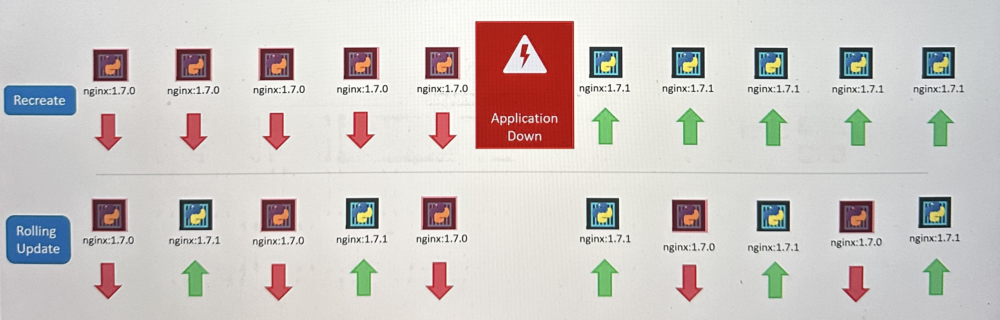

# Deployments

A Deployment deploys and manages the [ReplicaSet](replicasets.md) controller but brings more functions with it and is used for different use-cases:

* Deploy an application and run multiple instances
* Update instances of the application one-by-one (rolling update) and roll back updates in case of failure
* Pause and Restart instances for updates, configuration changes etc.
* Scale application
* Rollback to an older version

<figure><figcaption></figcaption></figure>

Creating a deployment with 3 replicas will result in creating following objects:

* 1 Deployment
* Which creates 1 ReplicaSet
* Which creates 3 Pods

<div align="left">

<figure><figcaption></figcaption></figure>

</div>


Deployments deploy pods in a random order; where as [Stateful Sets](statefulsets/) deploy pods in a specific order


## Rollouts

If a Deployment is created, it triggers a rollout. A new rollout creates a new deployment revision. In the future when the application is upgraded, meaning when the container version is updated to a new one, a new rollout is triggered and a new deployment revision is created.

This enables a rollback to a specific Revision. View status of Rollout:

**`$ kubectl rollout status deployment/<name>`**

View history of Rollout/Revisions:

**`$ kubectl rollout history deployment <deployment name>`**

## Deployment Strategies

1. **`Recreate`** - Application will be down
2. **`Rolling Update`** - Application will upgrade seamless

Additional strategies, which can't be specified as a strategy in the deployment yaml, instead they are more like an different implementation:&#x20;

1. **`Blue/Green`** - A strategy where a set of upgraded Pods (green) are deployed alongside the old Pods (blue) and 100% of the traffic is still routed to the old version. At some point the traffic is redirected completely to the new versions and the old versions can be deleted
2. **`Canary`** - Same as on Blue/Green, a new Deployment is created alongside the old, but a small amount of traffic is already routed to the new Deployment. If everything works fine, the traffic is routed completely to the new version.

By default, the Deployment Strategy is **`Rolling Update`**. The Deployment Strategy can be defined in the deployment yaml config.

<figure><figcaption></figcaption></figure>

### Rolling Updates

On a rolling update, Kubernetes will create a new ReplicaSet, destroy the Pods on the old ReplicaSet and recreate them on the new ReplicaSet one by one (Destroy one Pod, create one new Pod...).

1. Simply modify the deployment yaml config
2. Run **`$ kubectl apply -f <deployment.yaml>`**

### Rollback

On a rollback, Kubernetes will destroy the Pods on the new ReplicaSet and recreate them on the old ReplicaSet again one by one. Run to rollback deployment:

**`$ kubectl rollout undo deployment/<name>`**&#x20;

### Blue/Green

In order to deploy according to the blue/green strategy follow those steps:

1. Add a label to the old deployment e.g **`version=v1`**
2. Connect the old deployment to a Service by selecting the label **`version=v1`**
3. Create a new deployment with the upgraded Pods and label it with **`version=v2`**
4. Now switch the service label selectors to select the label **`version=v2`**&#x20;

### Canary

In order to deploy according to the blue/green strategy follow those steps:

1. Create a new Deployment and assign the same labels to the old Deployment so that both Deployments are labeled e.g as **`app=frontend`**
2. Connect the Service to the Deployments by selecting the label **`app=frontend`**
3. Now traffic will be routed to both Deployments. In order to split the traffic, it's necessary to change the replicas since the traffic is splitted equally over all replicas. Examples:
   * 10 Pods on old Deployment, 1 Pod on new Deployment = 10% Traffic is routed to new Deployment
   * 100 Pods on old Deployment, 1 Pod on new Deployment = 1% Traffic is routed to new Deployment
   * The problem here is, that the % of traffic can only be controlled by amount of replicas (bad). There are frameworks which with you can controll the amount of traffic

## YAML-Configuration&#x20;

```
apiVersion: apps/v1
kind: Deployment
metadata:
  name: nginx-deployment
  labels:
    app: nginx
spec:
  replicas: 3
  selector:
    matchLabels:
      app: nginx
  template:
    metadata:
      labels:
        app: nginx
    spec:
      containers:
      - name: nginx
        image: nginx:1.14.2
        ports:
        - containerPort: 80
```

## Commands

<table data-header-hidden><thead><tr><th width="224"></th><th></th></tr></thead><tbody><tr><td>Create Deployment</td><td><strong><code>$ kubectl create -f deployment.yaml</code></strong></td></tr><tr><td>Create Deployment and record changes</td><td><strong><code>$ kubectl create -f deployment.yaml --record</code></strong></td></tr><tr><td>Show all Deployments</td><td><strong><code>$ kubectl get deployments</code></strong></td></tr><tr><td>Show details of Pods</td><td><strong><code>$ kubectl describe deployment &#x3C;deployment name></code></strong></td></tr><tr><td>Edit Deployment</td><td><strong><code>$ kubectl edit deployment &#x3C;deployment name></code></strong></td></tr><tr><td>Rollout/Update Deployment</td><td><strong><code>$ kubectl apply -f &#x3C;deployment.yaml></code></strong></td></tr><tr><td>Show rollout history</td><td><strong><code>$ kubectl rollout history deployment &#x3C;deployment name></code></strong></td></tr><tr><td>Rollback</td><td><strong><code>$ kubectl rollout undo deployment/&#x3C;name></code></strong> </td></tr></tbody></table>
