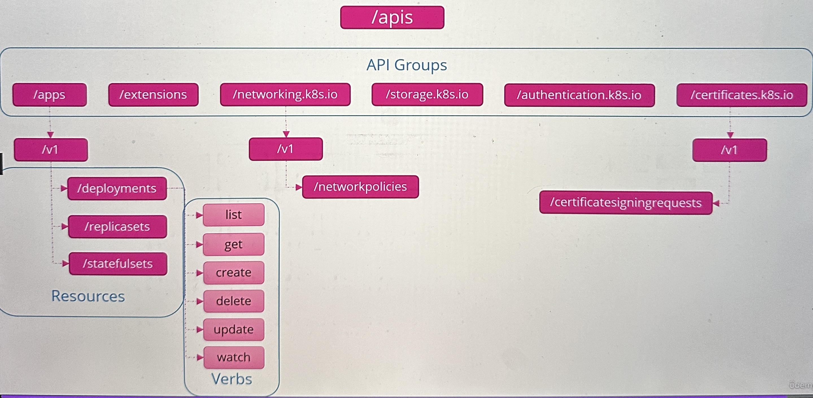
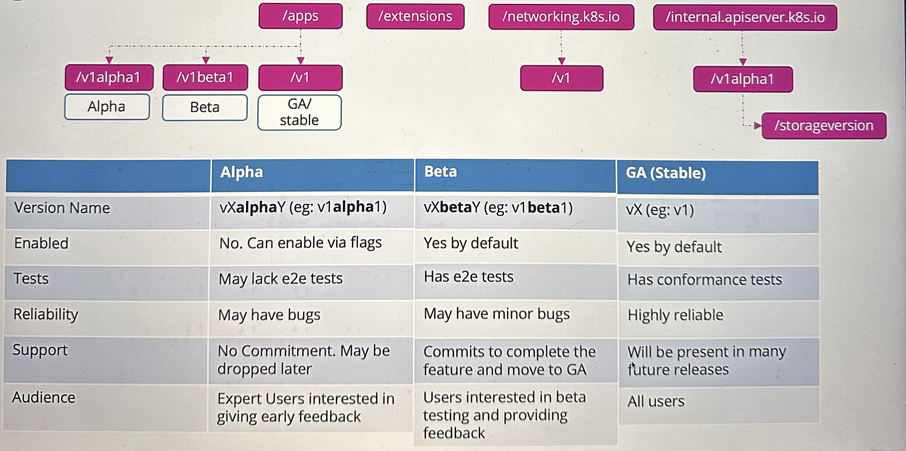
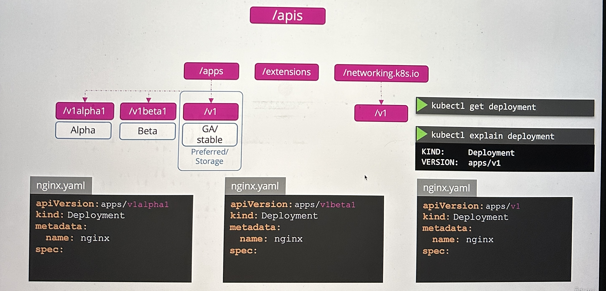

# Kubernets API

## Kubernetes API Groups

All resources in Kubernetes are grouped into different API Groups:

* API Groups
  * Resources
    * Verbs

<figure><figcaption></figcaption></figure>

## API Versions

<figure><figcaption></figcaption></figure>

Any API Group can support multiple API versions at the same time. But there is only on preferred version which is used when a command is executed.

<figure><figcaption></figcaption></figure>

## API Deprecations

API deprecations describes the process of adding new versions and removing old versions.&#x20;

* When can an old version be removed?
* When gets an old version deprecated?
* From which point on a version gets the preferred Version?

The API release process needs to follow certain rules:

1. API elements may only be removed by incrementing the version of the API group. Example:
   * v1alpha -> has a resource xy
   * v2alpha -> Resource xy can only be removed on the next version, but the new release still needs to support both versions
2. API objects must be able to round-trip between API versions in a given release without information loss, with the exception of whole REST resources that do not exist in some versions. Example:
   * If we create an API, an object in the v1alpha and it is converted to v2alpha  then back to v1alpha again, it should be the same as the original v1alpha.
3. An API version in a given track may not be deprecated until a new API Version at least stable is released
   * An alpha version cannot deprecated an v1, only an new stable version e.g v2 could deprecate v1 stable version
4. Other than the most recent API versions in each track, older API versions must be supported after their announced deprecation for duration of no less than:
   1. GA/Stable: 12 months or 3 releases
   2. Beta: 9 months or 3 releases
   3. Alpha: 0 releases

### Kubectl Convert

Convert a YAML file from an old-version to a new version:

**`$ kubectl convert -f <old-file> --output-version apps/v1`**

The **`kubectl convert`** command is not installed by default and needs to be installed.
