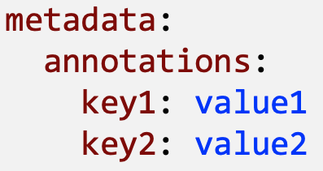

# Annotations

* Attach non-identifying metadata to objects
* Annotations are not used to identify and select objects (like labels)
* Useful for adding informations about the object

<div align="left">

<figure><figcaption></figcaption></figure>

</div>


```
apiVersion: v1
kind: Pod
metadata:
    name: myapp-pod
    annotations:
        app: myapp
        type: front-end
...
```

