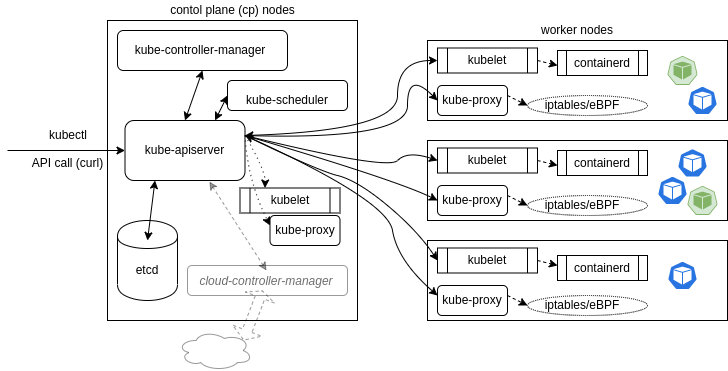

# Architecture

* Kubernetes is made of one or more master nodes (control panel) and worker nodes
  * A node can be a physical or virtual machine on which Kubernetes is installed
  * Each Node is running containers inside
* Multipe nodes running inside a Cluster. If one node fails, the load is redirected to other nodes - all this manged by the master node
* The master node runs an API server, a scheduler, various controllers and a datastore to keep the state of the cluster, container settings, and the networking configuration
  * Those components itselfs are also containers
* Usually multiple worker nodes run inside a cluster (if one node is not available, our application is still reachable via the other worker-nodes)

<figure><figcaption></figcaption></figure>

## Masternode components



* Exposes an API; All calls, both internal and external traffic, are handled via this agent
  * Each API call goes through three steps: authentication, authorization, and several admission controllers
* Responsible for communication with worker nodes
* Only agent which connects to the etcd database
* With the local client called _kubectl_ we can communicate with the API
  * Each _kubectl_ command send an CURL request to the kube-apiserver



* A scheduler constantly asks the kube-apiserver for newly created Pods that have no Node assigned
* For every new Pod that the scheduler discovers, the scheduler becomes responsible for finding the best Node for that Pod to run on
  * The scheduler checks available resources (such as available CPU) to bind, and then assign the Pod based on availability and success
* But also custom rules can be defined to decide where to put pods



* The state of the cluster, networking, and other persistent information is kept in an etcd database



## Workernode components



* The kubelet interacts with the underlying Docker Engine and makes sure that the containers that need to run are actually running
* It accepts the API calls for Pod specifications (a PodSpec is a JSON or YAML file that describes a Pod). It will work to configure the local node until the specification has been met
* Should a Pod require access to **storage**, **Secrets** or **ConfigMaps**, the kubelet will ensure access or creation
  * It also sends back status to the kube-apiserver for eventual persistence



* The kube-proxy container creates and manages local firewall rules and networking configuration to manage network connectivity to the containers
  * It does so through the use of iptables entries



## API Call Flow

API call flow describes the flow of communication between the above mentioned components. This example command `kubectl create deploy test...` will result in following API call flow:

1. After kubectl command is executed, kubectl will send a POST Curl request to the kube-apiserver
2. kube-apiserver send all informations about the deploy creation to the etcd database to persist the information
3. The moment later the kuber-controller-manager sends an API Request to kube-apiserver to ask if a spec changed (watch-loops)
   1. Kube-apiserver respond that the spec changed and there should be Deployment
   2. kube-controller-manager ask again if Deployment already exists
   3. If not it send again a Request to create the Deployment
4. Kube-apiserver sends request to etcd database to persist informations about the deployment creation
5. The deployment controller makes a request for creating a replicaSet. Same steps from 3 are repeated (watch-loops)
6. Now the replicaSet controller makes a request for creating a Pod. Same setps from 3 are repeated (watch-loops)
7. Kube-apiserver sends request to etcd database to persist informations about the deployment creation
8. Now the kube-apiserver asks the scheduler which of the available worker node should run the new pod
9. Scheduler answers on which worke node the new pod should run
10. Kube-apiserver informs the specific worker node to create and run the Pod
11. At the same time kube-apiserver informs all worker node kube-proxies about the new pod and the new networking configuration
12. kubelet now is responsible for downloading all resources like configMaps, secrets, mountings etc.
13. kubelet sends request to the local container engine (most likely docker) to create the pod
14. Docker engine informs kubelet about the success of Pod creation
15. Kubelet informs kube-apiserver about the success of Pod creation
16. Kube-apiserver persists information
17. Watch-loops repeat

<figure><figcaption></figcaption></figure>
