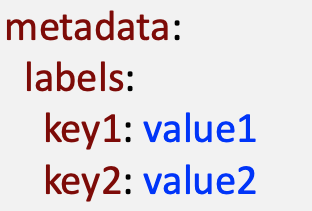

# Labels

* Labels are key/value pairs that are attached to objects
  * Either attached at creation time by yaml definition or added and modified at any time
  * Label Key must be unique for a given object (not unique accross objects}
* Labels can be used to organize and to select subsets of objects. It helps to manage objects in a big cluster. Examples:
  * Group objects by application
  * Group objects by functionality
  * etc.

<div align="left"><figure><figcaption></figcaption></figure></div>


```
apiVersion: v1
kind: Pod
metadata:
    name: myapp-pod
    labels:
        app: myapp
        type: front-end
...
```


## Label Selectors

The API currently supports two types of selectors: _equality-based_ and _set-based._

### Equality-Based Selectors

* Equal =
* Inequal !=

```
environment = production
tier != frontend
```

### Set-Base Selectors

* in
* notin
* exists !

```
environment in (production, qa)
tier notin (frontend, backend)
partition
!partition
```

### Usage

Usage for object allowing selectors:

```yaml
selector:
  matchLabels:
    component: redis
  matchExpressions:
    - { key: tier, operator: In, values: [cache] }
    - { key: environment, operator: NotIn, values: [dev] }
```

Usage with imperative commands:

```
$ kubectl get pods -l environment=production,tier=frontend
$ kubectl get pods -l 'environment in (production),tier in (frontend)' # OR operation seperated by comma
```
